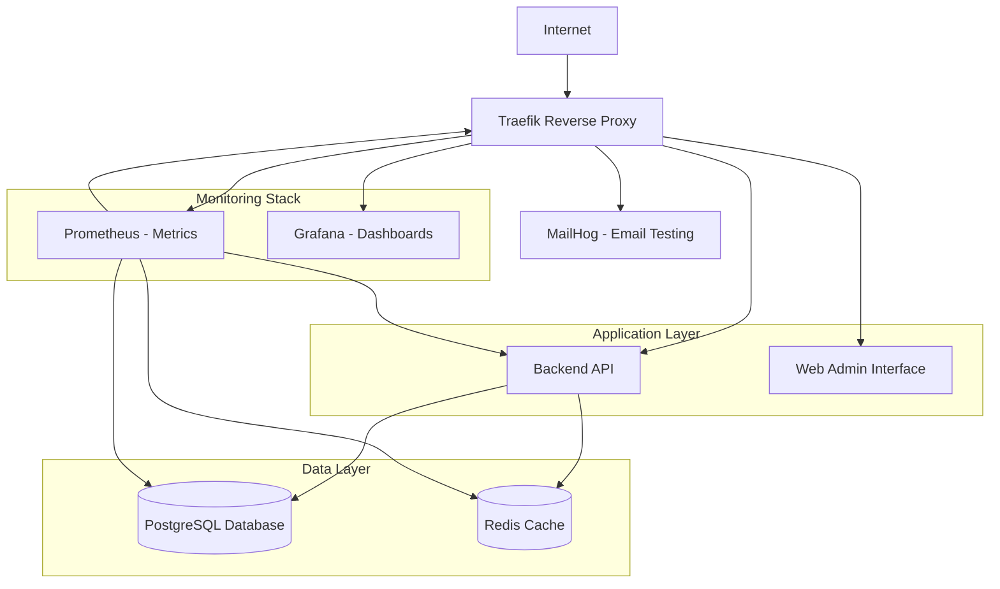

# 🏗️ Local & Staging Environment Infrastructure

## 📋 Overview

This directory contains the complete infrastructure setup for GarageReg local development and staging environments. The infrastructure is built using Docker Compose with Traefik as a reverse proxy, providing SSL termination, load balancing, and service discovery.

## 🏛️ Architecture



## 🚀 Quick Start

### Prerequisites

- Docker Desktop (Windows/Mac) or Docker Engine + Docker Compose (Linux)
- Git
- OpenSSL (for certificate generation)
- 8GB+ RAM recommended
- 20GB+ free disk space

### One-Command Setup

```bash
# Clone repository and setup everything
git clone <repository-url>
cd garagereg
chmod +x scripts/setup-local.sh
./scripts/setup-local.sh
```

### Manual Setup

1. **Generate TLS Certificates**
   ```bash
   cd infra/traefik
   chmod +x generate-certs.sh
   ./generate-certs.sh
   ```

2. **Setup Environment**
   ```bash
   cd infra
   cp .env.example .env
   # Edit .env with your preferences
   ```

3. **Add Hosts Entries**
   ```bash
   # Add to /etc/hosts (Linux/Mac) or C:\Windows\System32\drivers\etc\hosts (Windows)
   127.0.0.1 garagereg.local
   127.0.0.1 api.garagereg.local
   127.0.0.1 admin.garagereg.local
   127.0.0.1 traefik.garagereg.local
   127.0.0.1 mail.garagereg.local
   127.0.0.1 metrics.garagereg.local
   127.0.0.1 dashboard.garagereg.local
   ```

4. **Start Services**
   ```bash
   docker compose up -d
   ```

5. **Run Database Migrations**
   ```bash
   docker compose exec backend alembic upgrade head
   ```

6. **Create Test Data**
   ```bash
   docker compose exec backend python create_simple_test_data.py
   ```

## 🌐 Service Access

### Applications
- **Admin Interface**: https://admin.garagereg.local
- **API Documentation**: https://api.garagereg.local/docs
- **API Redoc**: https://api.garagereg.local/redoc

### Development Tools
- **Traefik Dashboard**: https://traefik.garagereg.local (admin:admin)
- **MailHog (Email Testing)**: https://mail.garagereg.local
- **Prometheus (Metrics)**: https://metrics.garagereg.local
- **Grafana (Dashboards)**: https://dashboard.garagereg.local (admin:admin)

### Database Access
- **PostgreSQL**: `localhost:5432`
  - Database: `garagereg`
  - Username: `garagereg`
  - Password: (check `.env` file)

- **Redis**: `localhost:6379`
  - Password: (check `.env` file)

## 📁 Directory Structure

```
infra/
├── docker-compose.yml          # Main orchestration file
├── .env.example               # Environment template
├── .env                       # Environment variables (generated)
├── traefik/
│   ├── dynamic/
│   │   └── tls.yml           # TLS and middleware configuration
│   ├── certs/                # Generated TLS certificates
│   └── generate-certs.sh     # Certificate generation script
├── db/
│   ├── config/
│   │   └── postgresql.conf   # PostgreSQL configuration
│   └── init/
│       └── 01-init-extensions.sh  # Database initialization
├── redis/
│   └── redis.conf           # Redis configuration
└── monitoring/
    ├── prometheus.yml       # Prometheus configuration
    └── grafana/
        └── provisioning/    # Grafana auto-provisioning
```

## ⚙️ Configuration

### Environment Variables

Key environment variables in `.env`:

```bash
# Database
DB_NAME=garagereg
DB_USER=garagereg
DB_PASSWORD=<generated>

# Redis
REDIS_PASSWORD=<generated>

# Application
SECRET_KEY=<generated>
ENVIRONMENT=development
DEBUG=true

# Domains
DOMAIN=garagereg.local
API_DOMAIN=api.garagereg.local
ADMIN_DOMAIN=admin.garagereg.local
```

### TLS Certificates

The setup generates self-signed certificates for local development:

- **CA Certificate**: `infra/traefik/certs/ca.crt`
- **Domain Certificate**: `infra/traefik/certs/garagereg.local.crt`
- **Wildcard Certificate**: `infra/traefik/certs/wildcard.garagereg.local.crt`

To trust certificates in your system:
- **Windows**: Import `ca.crt` to "Trusted Root Certification Authorities"
- **macOS**: `sudo security add-trusted-cert -d -r trustRoot -k /Library/Keychains/System.keychain ca.crt`
- **Linux**: `sudo cp ca.crt /usr/local/share/ca-certificates/ && sudo update-ca-certificates`

## 🐳 Docker Services

### Core Services

| Service | Description | Image | Ports |
|---------|-------------|-------|-------|
| `traefik` | Reverse proxy & SSL termination | `traefik:v3.1` | 80, 443, 8080 |
| `postgres` | PostgreSQL database | `postgres:15-alpine` | 5432 |
| `redis` | Redis cache & session store | `redis:7-alpine` | 6379 |
| `backend` | FastAPI application | Custom build | - |
| `web-admin` | React admin interface | Custom build | - |

### Monitoring Services

| Service | Description | Image | Ports |
|---------|-------------|-------|-------|
| `prometheus` | Metrics collection | `prom/prometheus:latest` | - |
| `grafana` | Metrics visualization | `grafana/grafana:latest` | - |

### Development Services

| Service | Description | Image | Ports |
|---------|-------------|-------|-------|
| `mailhog` | Email testing | `mailhog/mailhog:latest` | - |

## 🔧 Management Commands

### Service Management
```bash
# Start all services
docker compose up -d

# Stop all services
docker compose down

# View logs
docker compose logs -f [service_name]

# Restart specific service
docker compose restart backend

# View service status
docker compose ps

# Execute command in service
docker compose exec backend bash
docker compose exec postgres psql -U garagereg -d garagereg
```

### Development Commands
```bash
# Run database migrations
docker compose exec backend alembic upgrade head

# Create migration
docker compose exec backend alembic revision --autogenerate -m "Description"

# Run tests
docker compose exec backend pytest

# Access backend shell
docker compose exec backend python

# View API logs
docker compose logs -f backend
```

### Data Management
```bash
# Backup database
docker compose exec postgres pg_dump -U garagereg garagereg > backup.sql

# Restore database
cat backup.sql | docker compose exec -T postgres psql -U garagereg garagereg

# Reset database (DANGER: Deletes all data)
docker compose down -v
docker compose up -d postgres
docker compose exec backend alembic upgrade head
```

## 🔍 Monitoring & Observability

### Prometheus Metrics

Available metrics endpoints:
- Backend API: `http://backend:8000/metrics`
- Traefik: `http://traefik:8080/metrics`
- PostgreSQL: Via postgres_exporter
- Redis: Via redis_exporter

### Grafana Dashboards

Pre-configured dashboards for:
- Application Performance Monitoring (APM)
- Database Performance
- Infrastructure Metrics
- Request/Response Metrics
- Error Rates and Latencies

### Log Aggregation

Logs are available via Docker Compose:
```bash
# All services
docker compose logs -f

# Specific service
docker compose logs -f backend

# Follow new logs
docker compose logs -f --tail=100 backend
```

## 🔐 Security

### TLS Configuration

- **TLS 1.2/1.3 only**: Modern encryption protocols
- **HSTS**: Strict Transport Security enabled
- **Security Headers**: Comprehensive security headers
- **Certificate Validation**: Automatic certificate management

### Network Security

- **Internal Network**: Isolated Docker network
- **Firewall Rules**: Services only accessible via Traefik
- **Secrets Management**: Environment-based secrets
- **Rate Limiting**: API rate limiting configured

### Authentication & Authorization

- **JWT Tokens**: Secure API authentication
- **Session Management**: Redis-based sessions
- **Password Hashing**: bcrypt with salt
- **CORS**: Configured for development domains

## 🚨 Troubleshooting

### Common Issues

1. **Services not starting**
   ```bash
   # Check service status
   docker compose ps
   
   # View logs for failed service
   docker compose logs [service_name]
   
   # Check resource usage
   docker system df
   ```

2. **TLS Certificate errors**
   ```bash
   # Regenerate certificates
   cd infra/traefik
   rm -rf certs/*
   ./generate-certs.sh
   
   # Trust CA certificate in browser
   ```

3. **Database connection issues**
   ```bash
   # Check database status
   docker compose exec postgres pg_isready -U garagereg
   
   # View database logs
   docker compose logs postgres
   
   # Connect manually
   docker compose exec postgres psql -U garagereg -d garagereg
   ```

4. **Memory/Performance issues**
   ```bash
   # Check resource usage
   docker stats
   
   # Adjust memory limits in docker-compose.yml
   # Prune unused resources
   docker system prune -f
   ```

### Health Checks

All services include health checks. View health status:
```bash
docker compose ps
```

### Service Dependencies

Services start in dependency order:
1. Infrastructure (Traefik, PostgreSQL, Redis)
2. Backend (depends on DB/Redis)
3. Frontend (depends on Backend)
4. Monitoring (depends on all services)

## 🔄 CI/CD Integration

### GitHub Actions

The infrastructure supports automated CI/CD:

- **Build**: Multi-stage Docker builds
- **Test**: Integration testing with real services
- **Security**: Vulnerability scanning
- **Deploy**: Automated deployment to staging/production

### Pipeline Configuration

```yaml
# .github/workflows/infra-cd.yml
# Automated infrastructure deployment
# Validates, builds, tests, and deploys
```

## 🎯 Production Deployment

### Staging Environment

For staging deployment:
1. Update environment variables for staging
2. Use production-grade secrets
3. Enable monitoring and alerting
4. Configure backup strategies

### Production Considerations

- **Load Balancing**: Multiple backend instances
- **Database**: Managed PostgreSQL (AWS RDS, etc.)
- **Caching**: Managed Redis (AWS ElastiCache, etc.)
- **Monitoring**: External monitoring services
- **Backup**: Automated backup strategies
- **SSL**: Let's Encrypt or commercial certificates
- **CDN**: CloudFlare or AWS CloudFront

## 📚 Additional Resources

- [Docker Compose Documentation](https://docs.docker.com/compose/)
- [Traefik Documentation](https://doc.traefik.io/traefik/)
- [PostgreSQL Documentation](https://www.postgresql.org/docs/)
- [Redis Documentation](https://redis.io/documentation)
- [Prometheus Documentation](https://prometheus.io/docs/)
- [Grafana Documentation](https://grafana.com/docs/)

## 🤝 Support

For issues and questions:
1. Check this documentation
2. Review service logs
3. Check GitHub Issues
4. Contact development team

---

**Happy Development! 🚀**